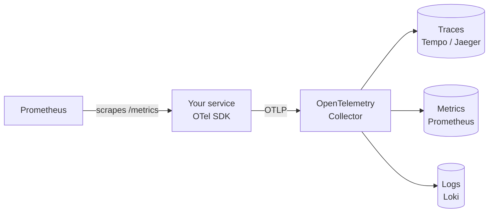

---
tags:
  - Observability
  - OpenShift
---

# Observability

**Monitoring** tells you *that* something is wrong. **Observability** lets you work out *why*, including for failures you didn't predict, from the data your system emits. In a cloud-native system a single request can cross many pods and services, so you need that data from every component, correlated.

## The three signals

| Signal | Answers | Example | Typical tools |
| --- | --- | --- | --- |
| **Metrics** | How much? How fast? Is it getting worse? | `greeting_requests_total{code="500"}` rising | Prometheus, Thanos |
| **Logs** | What exactly happened in this component? | `{"level":"ERROR","msg":"db timeout","trace_id":"5ebe..."}` | Loki, Elasticsearch |
| **Traces** | Where did this one request spend its time, across services? | `GET /greeting` 301 ms, of which `slow dependency` 300 ms | Tempo, Jaeger |

They work best together. An **alert** on a metric tells you errors are up. A **trace** of a failing request shows which service fails. That service's **logs**, found by the trace ID, show the error.

## OpenTelemetry

[OpenTelemetry](https://opentelemetry.io/) (OTel) is the CNCF standard for producing telemetry. It gives you vendor-neutral APIs and SDKs for instrumenting code, the **OTLP** protocol for sending data, and the **OpenTelemetry Collector** for receiving, processing and exporting it. Instrument your code once with OpenTelemetry, and you can send the data to Jaeger, Tempo, Prometheus or a commercial backend without changing the code.



The bootcamp's `greeting` sample app shows the common pattern:

- **Metrics:** exposes Prometheus metrics at `/metrics`: a request counter by path and status code, and a latency histogram.
- **Traces:** sends OpenTelemetry traces over OTLP when `OTEL_EXPORTER_OTLP_ENDPOINT` is set. The HTTP handler creates a span per request, and the code adds child spans such as `compose greeting`.
- **Logs:** writes structured JSON logs, and each line includes the `trace_id` of the request.

## What to measure

For request-driven services, start with the **RED** method, a subset of Google's [four golden signals](https://sre.google/sre-book/monitoring-distributed-systems/):

- **Rate:** requests per second
- **Errors:** failed requests per second, or as a ratio
- **Duration:** latency, usually as percentiles (p50, p95, p99), not averages

In PromQL, the Prometheus query language:

```promql
# Rate: requests per second, by status code
sum by (code) (rate(greeting_requests_total[5m]))

# Errors: share of requests that failed
sum(rate(greeting_requests_total{code=~"5.."}[5m])) / sum(rate(greeting_requests_total[5m]))

# Duration: 95th percentile latency
histogram_quantile(0.95, sum by (le) (rate(greeting_request_duration_seconds_bucket[5m])))
```

Turn the most important ones into **service level objectives (SLOs)**, for example "99.5% of requests succeed over 30 days". **Alert on symptoms users feel**, such as error rate and latency, rather than on causes such as CPU usage. That keeps alerts actionable.

## Observability on OpenShift

| Capability | OpenShift component |
| --- | --- |
| Cluster and platform metrics, dashboards and alerts | Built-in monitoring stack (Prometheus, Thanos, Alertmanager), under **Observe** in the web console |
| Metrics and alerts for your applications | **User workload monitoring**. You create `ServiceMonitor`, `PodMonitor` and `PrometheusRule` resources in your project. |
| Logs | Red Hat OpenShift Logging: the Vector collector with LokiStack storage |
| Traces | Red Hat OpenShift distributed tracing platform (Tempo) with the Red Hat build of OpenTelemetry (collector and auto-instrumentation) |
| Unified views in the console | Cluster Observability Operator UI plugins, for example logs, traces and troubleshooting panels |

### Scraping your application

User workload monitoring is enabled once per cluster by an administrator, by setting `enableUserWorkload: true` in the `cluster-monitoring-config` ConfigMap in the `openshift-monitoring` namespace. After that, you describe what to scrape with a **ServiceMonitor** in your own project:

```yaml title="ServiceMonitor"
apiVersion: monitoring.coreos.com/v1
kind: ServiceMonitor
metadata:
  name: greeting
spec:
  selector:
    matchLabels:
      app.kubernetes.io/name: greeting   # labels on the Service
  endpoints:
    - port: http                          # the Service port name
      path: /metrics
      interval: 15s
```

And you define alerts with a **PrometheusRule**:

```yaml title="PrometheusRule"
apiVersion: monitoring.coreos.com/v1
kind: PrometheusRule
metadata:
  name: greeting-alerts
spec:
  groups:
    - name: greeting
      rules:
        - alert: GreetingHighErrorRate
          expr: |
            sum by (namespace) (rate(greeting_requests_total{code=~"5.."}[2m]))
              /
            sum by (namespace) (rate(greeting_requests_total[2m])) > 0.1
          for: 1m
          labels:
            severity: warning
          annotations:
            summary: More than 10% of greeting requests are failing
```

The same `ServiceMonitor` and `PrometheusRule` APIs come from the Prometheus Operator, so these manifests also work on any Kubernetes cluster running it, including the [local lab cluster](../../lab-environments.md).

## Resources

=== "OpenShift"

    [Monitoring stack for Red Hat OpenShift :fontawesome-solid-chart-line:](https://docs.redhat.com/en/documentation/monitoring_stack_for_red_hat_openshift/latest/html/configuring_user_workload_monitoring/index){ .md-button target="_blank"}

    [Red Hat build of OpenTelemetry :fontawesome-solid-chart-line:](https://docs.redhat.com/en/documentation/red_hat_build_of_opentelemetry/){ .md-button target="_blank"}

    [Distributed tracing (Tempo) :fontawesome-solid-chart-line:](https://docs.redhat.com/en/documentation/red_hat_openshift_distributed_tracing_platform/){ .md-button target="_blank"}

    [OpenShift Logging :fontawesome-solid-chart-line:](https://docs.redhat.com/en/documentation/red_hat_openshift_logging/){ .md-button target="_blank"}

=== "Kubernetes"

    [OpenTelemetry documentation :fontawesome-solid-chart-line:](https://opentelemetry.io/docs/){ .md-button target="_blank"}

    [Querying Prometheus :fontawesome-solid-chart-line:](https://prometheus.io/docs/prometheus/latest/querying/basics/){ .md-button target="_blank"}

    [Jaeger :fontawesome-solid-chart-line:](https://www.jaegertracing.io/docs/latest/){ .md-button target="_blank"}

## Activities

| Lab | Description |
| --- | ----------- |
| [Lab 13 - Observability](../../labs/kubernetes/lab13/index.md) | Scrape metrics, fire an alert, trace a slow request, and correlate logs |
