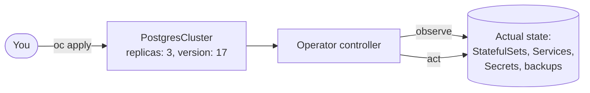

# What are OpenShift Operators

## Overview

An **Operator** is a way to package, deploy and manage a Kubernetes application using Kubernetes itself. It captures the knowledge of a human operator (how to install, upgrade, back up, scale and repair a piece of software) in code that runs in the cluster.

An Operator has two parts:

- **Custom Resource Definitions (CRDs)** add new API types to the cluster, such as `PostgresCluster` or `Kafka`. You describe what you want in a custom resource, just like a Deployment.
- **A controller** watches those resources and continuously **reconciles** the cluster toward the desired state: creating StatefulSets, Services and Secrets, running upgrades, taking backups and recovering from failures.

Red Hat® OpenShift® Operators automate the creation, configuration, and management of instances of Kubernetes-native applications. Operators provide automation at every level of the stack, from managing the parts that make up the platform all the way to applications that are provided as a managed service.

Red Hat OpenShift uses the power of Operators to run the entire platform in an autonomous fashion while exposing configuration natively through Kubernetes objects, allowing for quick installation and frequent, robust updates. Run `oc get clusteroperators` to see the operators that manage OpenShift itself: networking, ingress, the image registry, monitoring and more.

Included in Red Hat OpenShift is **OperatorHub** (**Ecosystem > Software Catalog** in the OpenShift 4.20 and later web console), a catalog of certified Operators from software vendors and open source projects. From it you can browse and install Operators that have been verified to work with Red Hat OpenShift and that are packaged for easy lifecycle management by the **Operator Lifecycle Manager (OLM)**. The OpenShift Pipelines and OpenShift GitOps used in the [DevOps labs](../../labs/index.md#continuous-integration) are installed this way.

!!! info "OLM v1"
    OpenShift 4.18 and later also include **OLM v1**, a simpler next-generation lifecycle manager. With OLM v1 you install an operator from a catalog with a single `ClusterExtension` resource instead of an `OperatorGroup` plus `Subscription`. The classic OLM that OperatorHub uses remains fully supported, and it's what the pages in this section describe.

## Learn more

- [Operator Catalog](operatorCatalog.md): where operators come from and how catalogs work
- [Using Operators](operatorUsage.md): installing operators and creating their custom resources
- [Operator pattern (Kubernetes docs)](https://kubernetes.io/docs/concepts/extend-kubernetes/operator/)
- [Operator Framework](https://operatorframework.io/): the SDK and tools for building your own operators
