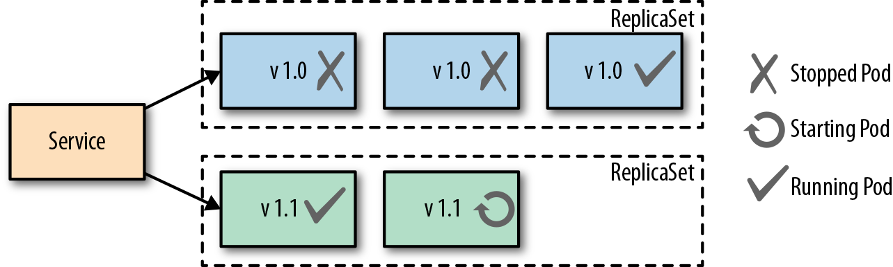
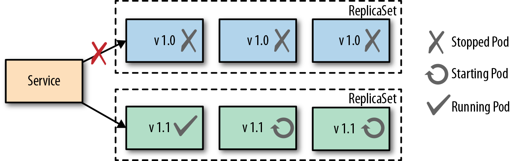
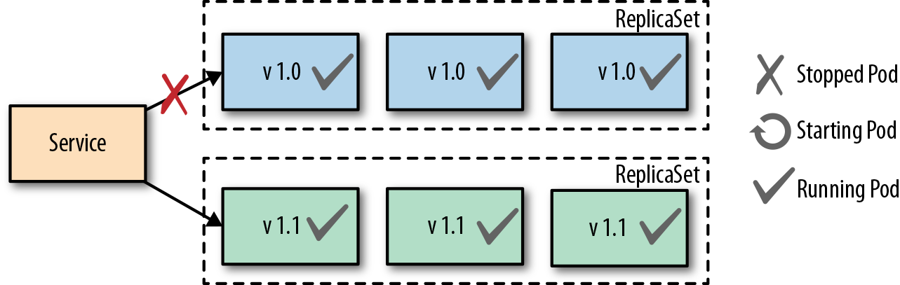
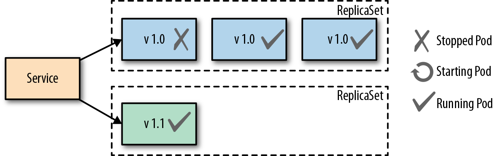

---
tags:
  - Kubernetes
  - Workloads
---

# Concepts in Container Orchestration

## Declarative Deployment Pattern

With a growing number of microservices, reliance on an updating process for the services has become ever more important. Upgrading services is usually accompanied with some downtime for users or an increase in resource usage.  Both of these can lead to an error effecting the performance of the application making the release process a bottleneck.  

A way to combat this issue in Kubernetes is through the use of Deployments.  There are different approaches to the updating process that we will cover below. Any of these approaches can be put to use in order to save time for developers during their release cycles which can last from a few minutes to a few months. 

### Rolling Deployment

A Rolling Deployment ensures that there is no downtime during the update process.  Kubernetes creates a new ReplicaSet for the new version of the service to be rolled out, then **incrementally** scales the new ReplicaSet up and the old one down. A new pod has to pass its readiness probe before an old pod is removed, so users are always served by ready pods. `maxSurge` (how many extra pods may be created) and `maxUnavailable` (how many pods may be missing) control the pace.



The upside to this approach is that there is no downtime and the whole process is handled by Kubernetes. `RollingUpdate` is the default strategy for Deployments:

```yaml
apiVersion: apps/v1
kind: Deployment
metadata:
  name: my-app
spec:
  replicas: 4
  strategy:
    type: RollingUpdate
    rollingUpdate:
      maxSurge: 1        # at most 5 pods during the update
      maxUnavailable: 0  # never go below 4 ready pods
  selector:
    matchLabels:
      app: my-app
  template:
    metadata:
      labels:
        app: my-app
    spec:
      containers:
        - name: my-app
          image: quay.io/nginx/nginx-unprivileged:1.29
```

The downside is that two versions run side by side during the rollout, so the application must tolerate that (for example, compatible database schemas and APIs), and extra pods temporarily use more resources.

### Fixed Deployment 

A Fixed Deployment uses the `Recreate` strategy (`spec.strategy.type: Recreate`). Kubernetes first terminates **all** pods of the old version, and only then starts the pods of the new version.  This creates downtime between the old pods stopping and the new pods becoming ready, but the positive side is that two versions never run at the same time, which some applications (for example, ones that hold an exclusive lock or migrate a database on startup) require.



### Blue-Green Release

A Blue-Green Release involves a manual process of creating a second deployment of pods with the newest version of the application running as well as keeping the old version of pods running in the cluster.  Once the new pods are up and running properly the administrator shifts the traffic over to the new pods. Below is a diagram showing both versions up and running with the traffic going to the newer (green) pods.



The downfall to this approach is the use of resources with two separate groups of pods running at the same time which could cause performance issues or complications. However, the advantage of this approach is users only experience one version at a time and it's easy to quickly switch back to the old version with no downtime if an issue arises with the newer version.


### Canary Release

A Canary Release involves only standing up one pod of the new application code and shifting only a limited amount of new users traffic to that pod.  This approach reduces the number of people exposed to the new service allowing the administrator to see how the new version is performing.  Once the team feels comfortable with the performance of the new service then more pods can be stood up to replace the old pods.  An advantage to this approach is no downtime with any of the services as the new service is being scaled. 



## Health Probe Pattern

The Health Probe pattern revolves around the health of applications being communicated to Kubernetes. To be fully-automatable, cloud-applications must be highly observable in order for Kubernetes to know which applications are up and ready to receive traffic and which cannot. Kubernetes can use that information for traffic direction, self-healing, and to achieve the desired state of the application.

Kubernetes offers three kinds of probes, each of which can run an HTTP GET, TCP socket, gRPC or exec check:

| Probe | Question it answers | Action on failure |
| --- | --- | --- |
| **Startup** | Has the app finished starting? | Keep waiting; liveness and readiness probes don't run until it succeeds. Restart after `failureThreshold` failures |
| **Liveness** | Is the app still working? | Restart the container |
| **Readiness** | Can the app take traffic right now? | Remove the pod from Service endpoints until it recovers |

### Process Health Checks

The simplest health check in kubernetes is the Process Health Check.  Kubernetes simply probes the application's processes to see if they are running or not. The process check tells kubernetes when a process for an application needs to be restarted or shut down in the case of a failure.

### Liveness Probes

A Liveness Probe is performed by the Kubernetes Kubelet agent and asks the container to confirm its health.  A simple process check can return that the container is healthy, but the container to users may not be performing correctly.  The liveness probe addresses this issue by asking the container for its health from outside of the container itself. If a failure is found it may require that the container be restarted to get back to normal health.  A liveness probe can perform the following actions to check health:

- HTTP GET and expects a success which is code 200-399.
- A TCP Socket Probe and expects a successful connection.
- An Exec Probe which executes a command and expects a successful exit code (0).
- A gRPC probe which calls the standard gRPC health checking service.

The action chosen to be performed for testing depends on the nature of the application and which action fits best. Always keep in mind that a failing health check results in a restart of the container from Kubernetes, so make sure the right health check is in place if the underlying issue can't be fixed.

### Readiness Probes

A Readiness Probe is very similar to a Liveness probe, but the resulting action to a failed Readiness probe is different.  When a liveness probe fails the container is restarted and, in some scenarios, a simple restart won't fix the issue, which is where a readiness probe comes in.  A failed readiness probe won't restart the container but will disconnect it from the traffic endpoint.  Removing a container from traffic allows it to get up and running smoothly before being tossed into service unready to handle requests from users.  Readiness probes give an application time to catch up and make itself ready again to handle more traffic versus shutting down completely and simply creating a new pod. In most cases, liveness and readiness probes are run together on the same application to make sure that the container has time to get up and running properly as well as stays healthy enough to handle the traffic. 


## Managed Lifecycle Pattern

The Managed Lifecycle pattern describes how containers need to adapt their lifecycles based on the events that are communicated from a managing platform such as Kubernetes.  Containers do not have control of their own lifecycles.  It's the managing platforms that allow them to live or die, get traffic or have none, etc.  This pattern covers how the different events can affect those lifecycle decisions.

### SIGTERM

SIGTERM is the signal Kubernetes sends to the main process of each container when a pod is being stopped, for example during a rolling update, a scale-down, a node drain, or after a failed liveness probe.  SIGTERM lets the application clean up and shut itself down properly, unlike SIGKILL, which we will get to next. Once received, the application will shutdown as quickly as it can, allowing other processes to stop properly and cleaning up other files.  Each application will have a different shutdown time based on the tasks needed to be done.

### SIGKILL

SIGKILL is a signal sent to a container or pod forcing it to shutdown.  A SIGKILL is normally sent after the SIGTERM signal.  There is a default 30 second grace period between the time that SIGTERM is sent to the application and SIGKILL is sent.  The grace period can be adjusted for each pod using the .spec.terminationGracePeriodSeconds field. The overall goal for containerized applications should be aimed to have designed and implemented quick startup and shutdown operations.

### postStart

The postStart hook is a command that is run after the creation of a container and begins asynchronously with the container's primary process. PostStart is put in place in order to give the container time to warm up and check itself during startup.  Until the postStart hook completes, the container isn't marked as running and the pod doesn't become ready.  If the postStart function errors out it will do so with a nonzero exit code and the container process will be killed by Kubernetes.  Careful planning must be done when deciding what logic goes into the postStart function because if it fails the container will also fail to start.  Both postStart and preStop have two handler types that they run:

- exec: Runs a command directly in the container.

- httpGet: Executes an HTTP GET request against an opened port on the pod container.

- sleep: Pauses for a number of seconds (Kubernetes 1.30+), a simple way to delay shutdown until load balancers have stopped sending traffic.

### preStop

The preStop hook runs **before** SIGTERM is sent to the container, giving the application a chance to shut down gracefully, for example to finish in-flight requests or deregister from a service. SIGTERM is sent only after the hook completes. The hook doesn't pause the termination grace period: if the preStop hook and the application's shutdown together take longer than `terminationGracePeriodSeconds`, the container is killed with SIGKILL.
