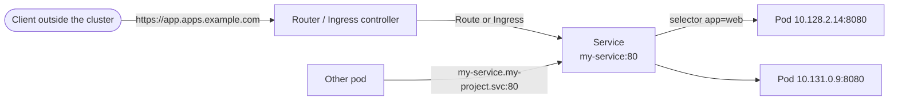

# Networking Overview

Kubernetes networking rests on a few simple rules, and OpenShift builds on them:

- **Every pod gets its own IP address.** All pods can reach each other directly, across nodes, without NAT. The cluster's network plugin (OVN-Kubernetes on OpenShift) implements this.
- **Pod IPs are temporary.** Pods are replaced during rollouts, scaling and failures, and each new pod gets a new IP. So clients shouldn't talk to pod IPs directly.
- **Services give pods a stable address.** A Service selects pods by label and provides a fixed virtual IP and DNS name, load-balancing across whichever pods are ready.
- **Traffic from outside the cluster** comes in through a Route or Ingress (HTTP/HTTPS), a Gateway, or a `LoadBalancer`/`NodePort` Service (any TCP/UDP).
- **NetworkPolicies** restrict which pods may talk to which.



## Service discovery with DNS

Every Service gets a DNS name, `<service>.<namespace>.svc.cluster.local`. Pods in the same namespace can simply use `<service>`, and pods in other namespaces use `<service>.<namespace>`. Each port of the Service is reachable at that name:

```bash
curl http://my-service:80                  # same namespace
curl http://my-service.other-project:80    # another namespace
```

## Ways to expose an application

| Mechanism | Scope | Use it for |
| --- | --- | --- |
| [Service](services.md) `ClusterIP` | Inside the cluster | Pod-to-pod communication. This is the default type. |
| [Service](services.md) `NodePort` | Every node's IP, on a port from 30000–32767 | Testing, or when an external load balancer targets the nodes |
| [Service](services.md) `LoadBalancer` | A cloud load balancer with its own IP | Non-HTTP protocols on cloud platforms |
| [Route](routes.md) | Hostname on the OpenShift router | HTTP/HTTPS apps on OpenShift, with TLS options and traffic splitting |
| [Ingress](ingress.md) | Hostname on an ingress controller | Portable HTTP/HTTPS routing (OpenShift turns it into a Route) |
| [Gateway API](ingress.md#references) | Gateways shared by many teams | The successor to Ingress on upstream Kubernetes. OpenShift supports it from 4.19. |

## Controlling traffic between pods

By default every pod accepts traffic from every other pod. Use [Network Policies](network-policies.md) to allow only the traffic an application needs, for example "only the frontend may call the API on port 8080".

## Resources

=== "OpenShift"

    [Ingress and load balancing :fontawesome-solid-network-wired:](https://docs.redhat.com/en/documentation/openshift_container_platform/latest/html/ingress_and_load_balancing/index){ .md-button target="_blank"}

    [Network security :fontawesome-solid-network-wired:](https://docs.redhat.com/en/documentation/openshift_container_platform/latest/html/network_security/index){ .md-button target="_blank"}

=== "Kubernetes"

    [Services, Load Balancing, and Networking :fontawesome-solid-network-wired:](https://kubernetes.io/docs/concepts/services-networking/){ .md-button target="_blank"}

    [DNS for Services and Pods :fontawesome-solid-network-wired:](https://kubernetes.io/docs/concepts/services-networking/dns-pod-service/){ .md-button target="_blank"}

## Activities

| Lab | Description |
| --- | ----------- |
| [Lab 9 - Services](../../labs/kubernetes/lab9/index.md) | Expose deployments inside and outside the cluster |
| [Lab 10 - Network Policies](../../labs/kubernetes/lab10/index.md) | Allow only labelled clients to reach a secure pod |
| [Lab 11 - Routes & Ingress](../../labs/kubernetes/lab11/index.md) | Publish an app with an OpenShift Route and a Kubernetes Ingress |
