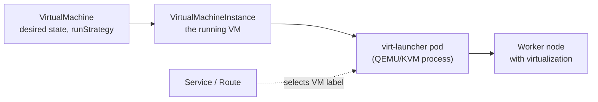

---
tags:
  - Virtualization
  - OpenShift
---

# OpenShift Virtualization

Not every workload can move to containers right away. Many organizations run hundreds of virtual machines they can't rewrite: vendor appliances, legacy Windows or Linux applications, or systems that need a full OS. **OpenShift Virtualization** runs those VMs **on the same OpenShift cluster** as your containers, managed with the same tools: `oc`, YAML, RBAC, Services, Routes, NetworkPolicies, GitOps and pipelines.

It's built on **[KubeVirt](https://kubevirt.io/)**, a CNCF project that adds virtual machines to the Kubernetes API. Each VM runs inside a regular pod (the `virt-launcher` pod) using the Linux KVM hypervisor, so the scheduler, networking and storage treat it like any other workload.



## Why run VMs on OpenShift?

- **One platform:** VMs and containers share the same clusters, networks, storage, monitoring and security, instead of a separate virtualization silo.
- **Modernize gradually:** move a VM to OpenShift first (*relocate* or *rehost*), then break pieces out into containers over time, with VMs and containers talking over normal Kubernetes Services.
- **Same automation:** VMs are YAML, so they can be versioned in Git, deployed by Argo CD and tested in pipelines.
- **Migration from other hypervisors:** the **Migration Toolkit for Virtualization (MTV)** moves VMs in bulk from VMware vSphere, Red Hat Virtualization and OpenStack.

## Key concepts

| Resource | What it is |
| --- | --- |
| `VirtualMachine` (VM) | The long-lived definition: CPU, memory, disks, networks and a `runStrategy` (`Always`, `Halted`, `Manual`, `RerunOnFailure`). Like a Deployment for one VM. |
| `VirtualMachineInstance` (VMI) | The running VM. It's created when the VM starts and deleted when it stops. Like a Pod. |
| `virt-launcher` pod | The pod that hosts the VM's QEMU/KVM process on a node |
| Instance types and preferences | Reusable sizes, such as `u1.small` (1 vCPU, 2 GiB) and `u1.medium` (1 vCPU, 4 GiB), and OS-specific defaults (`fedora`, `rhel.9`, `windows.2k22`), so VMs don't repeat CPU, memory and device settings |
| `DataVolume` / `DataSource` | Disks backed by PersistentVolumeClaims. The Containerized Data Importer (CDI) fills them from URLs, registries, uploads or **golden images**. OpenShift ships golden images (RHEL, Fedora, CentOS Stream) as DataSources in `openshift-virtualization-os-images`. |
| `containerDisk` | A disk image packaged as a container image. It's quick for demos and tests, but **ephemeral**: changes are lost when the VM restarts. |
| cloud-init / Sysprep | First-boot configuration of users, SSH keys, packages and services for Linux / Windows guests |

### Storage

For real workloads, give VMs **persistent** disks: DataVolumes that clone a golden image into a PVC. **Live migration**, which moves a running VM to another node with no downtime, for example during node maintenance, requires shared storage with **ReadWriteMany (RWX)** access, such as OpenShift Data Foundation or a CSI driver that supports RWX block volumes.

### Networking

By default, a VM is attached to the **pod network** with *masquerade* binding. It gets outbound access, and other pods reach it through a normal **Service** that selects the VM's labels. You can then expose it with a **Route**, and restrict it with **NetworkPolicies**, exactly as for containers. VMs that need to sit directly on a datacenter VLAN get additional interfaces through **Multus** and **NMState** (`NetworkAttachmentDefinition`, `NodeNetworkConfigurationPolicy`).

### Where it runs

VMs need hardware virtualization on the worker nodes. That means OpenShift on **bare metal**, or on cloud instances that expose virtualization, such as bare-metal instance types. It's installed from OperatorHub as the **OpenShift Virtualization** operator, and configured through a `HyperConverged` resource in the `openshift-cnv` namespace. See [Lab Environments](../../lab-environments.md#virtualization).

## Working with VMs

=== "OpenShift"

    ``` Bash title="Create a VM from a golden image, sized with an instance type"
    virtctl create vm --name rhel9-vm \
      --instancetype u1.small --preference rhel.9 \
      --volume-import type:ds,src:openshift-virtualization-os-images/rhel9,size:30Gi \
      --user cloud-user --ssh-key "$(cat ~/.ssh/id_ed25519.pub)" | oc apply -f -
    ```

    ``` Bash title="Lifecycle and access"
    oc get vm,vmi
    virtctl console rhel9-vm          # serial console (Ctrl+] to exit)
    virtctl ssh cloud-user@vm/rhel9-vm
    virtctl stop rhel9-vm
    virtctl start rhel9-vm
    virtctl migrate rhel9-vm          # live migrate (needs RWX storage)
    ```

    The web console also has a full VM experience under **Virtualization > VirtualMachines**, including a catalog of templates, a VNC console, metrics and snapshots.

=== "Kubernetes (KubeVirt)"

    ``` Bash title="Lifecycle and access"
    kubectl get vm,vmi
    virtctl console my-vm
    virtctl stop my-vm
    virtctl start my-vm
    ```

    KubeVirt and the Containerized Data Importer are installed separately on upstream Kubernetes. See the [KubeVirt quickstarts](https://kubevirt.io/user-guide/).

## Resources

=== "OpenShift"

    [OpenShift Virtualization :fontawesome-solid-server:](https://docs.redhat.com/en/documentation/openshift_container_platform/latest/html/virtualization/index){ .md-button target="_blank"}

    [Migration Toolkit for Virtualization :fontawesome-solid-server:](https://docs.redhat.com/en/documentation/migration_toolkit_for_virtualization/){ .md-button target="_blank"}

=== "Kubernetes"

    [KubeVirt user guide :fontawesome-solid-server:](https://kubevirt.io/user-guide/){ .md-button target="_blank"}

## Activities

| Lab | Description |
| --- | ----------- |
| [Lab 14 - Virtual Machines](../../labs/kubernetes/lab14/index.md) | Run a VM, log in, restart it, and expose a service it runs to containers and users |
